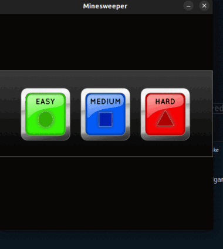
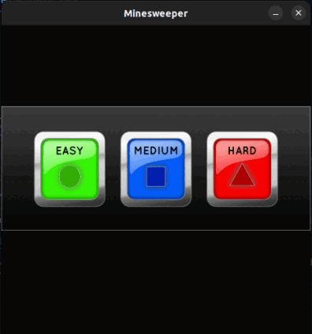

# MINESWEEPER

An Academic project on OOP( C++ ).

## Building Instructions
* The project was done using Linux filesystem, for the ease of building, use a linux machine.

* Dependencies: SDL 2.0 

* Using VScode as Code Editor

* Using make from commandline

### Project compilation
From our base project directory, type in the following commands:

First of all Install SDL2 dependencies using 

    $ sudo apt-get install libsdl2-dev

Then, Run the following command

```bash
$ cd minesweeper/
$ make
```
Once the object files are created we willn't need to run make repeatedly. You can run The game using the command

    $ ./minesweeper

 Basically game starts with a menu button in which you will get choice to choose Level.

 

# Authors
* [Rajendra Khanal](https://github.com/Rajendrakhanal)
* [Rajkumar paneru](https://github.com/Rajkumarpaneru18)